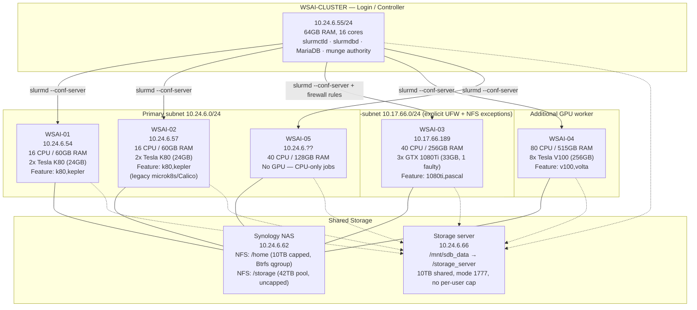

```mermaid
flowchart TB
    subgraph Login["WSAI-CLUSTER — Login / Controller"]
        C["10.24.6.55/24<br/>64GB RAM, 16 cores<br/>slurmctld · slurmdbd · MariaDB · munge authority"]
    end
 
    subgraph Sub1["Primary subnet 10.24.6.0/24"]
        W1["WSAI-01<br/>10.24.6.54<br/>16 CPU / 60GB RAM<br/>2x Tesla K80 (24GB)<br/>Feature: k80,kepler"]
        W2["WSAI-02<br/>10.24.6.57<br/>16 CPU / 60GB RAM<br/>2x Tesla K80 (24GB)<br/>Feature: k80,kepler<br/>(legacy microk8s/Calico)"]
        W5["WSAI-05<br/>10.24.6.??<br/>40 CPU / 128GB RAM<br/>No GPU — CPU-only jobs"]
    end
 
    subgraph Sub2["Off-subnet 10.17.66.0/24 (explicit UFW + NFS exceptions)"]
        W3["WSAI-03<br/>10.17.66.189<br/>40 CPU / 256GB RAM<br/>3x GTX 1080Ti (33GB, 1 faulty)<br/>Feature: 1080ti,pascal"]
    end
 
    subgraph Sub3["Additional GPU worker"]
        W4["WSAI-04<br/>80 CPU / 515GB RAM<br/>8x Tesla V100 (256GB)<br/>Feature: v100,volta"]
    end
 
    subgraph Storage["Shared Storage"]
        NAS["Synology NAS<br/>10.24.6.62<br/>NFS: /home (10TB capped, Btrfs qgroup)<br/>NFS: /storage (42TB pool, uncapped)"]
        S2["Storage server<br/>10.24.6.66<br/>/mnt/sdb_data → /storage_server<br/>10TB shared, mode 1777, no per-user cap"]
    end
 
    C -->|slurmd --conf-server| W1
    C -->|slurmd --conf-server| W2
    C -->|slurmd --conf-server + firewall rules| W3
    C -->|slurmd --conf-server| W4
    C -->|slurmd --conf-server| W5
 
    W1 --- NAS
    W2 --- NAS
    W3 --- NAS
    W4 --- NAS
    W5 --- NAS
 
    W1 -.-> S2
    W2 -.-> S2
    W3 -.-> S2
    W4 -.-> S2
    W5 -.-> S2
    C -.-> S2
```
